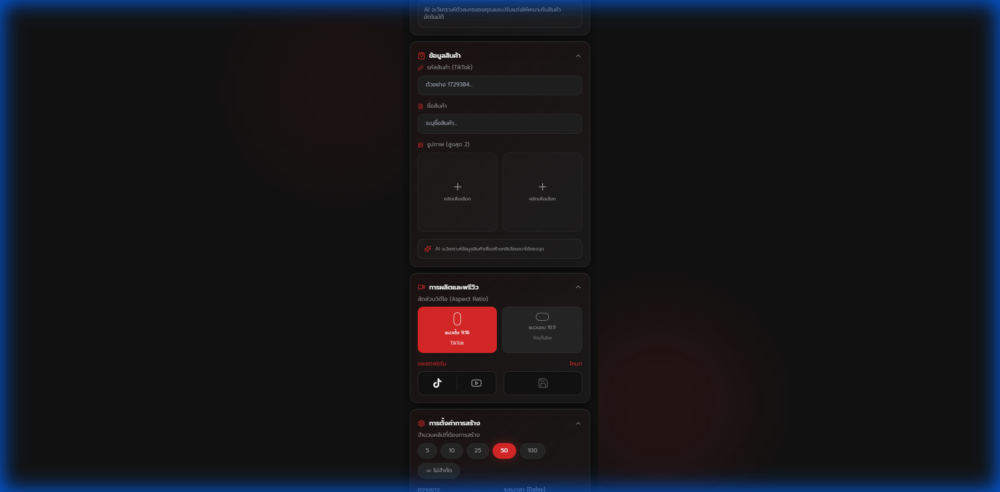

# รายงานสรุป - โครงสร้าง Chrome Extension แบบ Hybrid

## 1. ฟีเจอร์และสถานะล่าสุด (Current Status)

### 🧩 โครงสร้างระบบ (Architecture)
แอพนี้ทำงานแบบ **Hybrid Extension** ประกอบด้วย 2 ส่วนหลัก:
1.  **Side Panel (รีโมทคอนโทรล)**: แถบข้างขวาสำหรับป้อนข้อมูลและสั่งงาน AI
2.  **Content Script (จอแสดงผล)**: หน้าต่าง Overlay ลอยทับหน้าเว็บเพื่อแสดงผลวิดีโอ

### ✨ ฟีเจอร์ใหม่ (New Features)
- **Save Video Button**: ปุ่มดาวน์โหลดวิดีโอ (💾) ย้ายไปอยู่ตำแหน่งขวาในช่อง "Mode" ใช้งานง่ายและดูสะอาดตา
- **Platform Buttons**: แยกปุ่ม TikTok/YouTube ไว้ด้านซ้ายชัดเจน

---

## 2. วิธีการติดตั้งแบบละเอียด (Detailed Installation Guide)

หากคุณต้องการนำ Extension นี้ไปติดตั้งลงใน Chrome Browser ให้ทำตามขั้นตอนดังนี้ครับ:

### ขั้นตอนที่ 1: เตรียมไฟล์ (Build)
1.  ตรวจสอบว่าในโฟลเดอร์โปรเจกต์มีโฟลเดอร์ชื่อ `dist` อยู่หรือไม่
    - ถ้า **มี**: ไปขั้นตอนถัดไปได้เลย
    - ถ้า **ไม่มี**: ให้เปิด Terminal แล้วพิมพ์คำสั่ง `npm run build` รอจนเสร็จ

### ขั้นตอนที่ 2: เปิดโหมดนักพัฒนาใน Chrome
1.  เปิด Google Chrome
2.  ที่แถบ Address ด้านบน พิมพ์คำว่า `chrome://extensions` แล้วกด Enter
3.  มองที่ **มุมขวาบน** ของหน้าจอ จะมีสวิตช์เขียนว่า **"Developer mode"** (โหมดนักพัฒนาซอฟต์แวร์)
4.  กด **เปิดสวิตช์** ให้เป็นสีน้ำเงิน

### ขั้นตอนที่ 3: ลงโปรแกรม (Load Unpacked)
1.  เมื่อเปิด Developer mode แล้ว จะมีปุ่มใหม่โผล่มาด้านซ้ายบน 3 ปุ่ม
2.  ให้กดปุ่มแรกที่ชื่อว่า **"Load unpacked"** (โหลดส่วนขยายที่คลายการบีบอัดแล้ว)
3.  หน้าต่างเลือกไฟล์จะเด้งขึ้นมา
4.  ให้เข้าไปเลือก **โฟลเดอร์ `dist`** ที่อยู่ในโปรเจกต์ของเรา (`netflowai-main/dist`)
5.  กด **Select Folder** (เลือกโฟลเดอร์)

### ขั้นตอนที่ 4: เสร็จสิ้นการติดตั้ง
- คุณจะเห็นกล่องสี่เหลี่ยมของแอพ **NetFlow AI - Video Generator** ปรากฏขึ้นมาในรายการ
- ในกล่องนั้น ตรวจสอบว่าสวิตช์มุมขวาล่างเปิดอยู่ (สีน้ำเงิน)

### ขั้นตอนที่ 5: การเรียกใช้งาน (Pin & Open)
1.  คลิกที่ **ไอคอนจิ๊กซอว์ (Extensions)** บนแถบเมนูขวาบนของ Chrome (ข้างรูปโปรไฟล์)
2.  หาชื่อ **NetFlow AI** แล้วกดปุ่ม **หมุด (Pin)** ให้เป็นสีฟ้า เพื่อให้ไอคอนแอพมาโชว์ที่แถบเมนูเสมอ
3.  **ทดลองใช้:** กดที่ไอคอน NetFlow AI ของเรา -> เลือก "Open Side Panel" หรือ Side panel จะเด้งขึ้นมาเองทางด้านขวา

---

## 3. การอัปเดตเวอร์ชั่น (Updating)
หากมีการแก้โค้ดใหม่:
1.  รันคำสั่ง `npm run build` ใหม่ทุกครั้ง
2.  ไปที่หน้า `chrome://extensions`
3.  หาแอพของเรา แล้วกดปุ่ม **ลูกศรหมุนวน (Reload)** เล็กๆ ในกล่องแอพ
4.  แอพจะอัปเดตเป็นเวอร์ชั่นล่าสุดทันที ไม่ต้องลงใหม่

---

